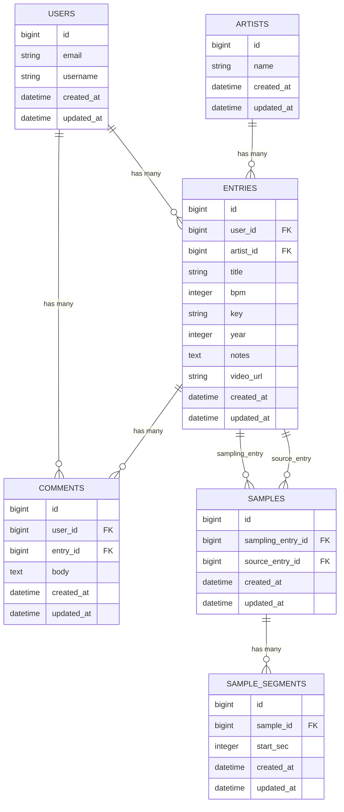

# ERD

```mermaid
erDiagram
  USERS ||--o{ ENTRIES : "has many"
  USERS ||--o{ COMMENTS : "has many"
  ARTISTS ||--o{ ENTRIES : "has many"
  ENTRIES ||--o{ COMMENTS : "has many"

  %% Sampling relationships (entries↔entries via samples)
  ENTRIES ||--o{ SAMPLES : "sampling_entry"
  ENTRIES ||--o{ SAMPLES : "source_entry"

  %% Sample segments (timing within source track)
  SAMPLES ||--o{ SAMPLE_SEGMENTS : "has many"

  USERS {
    bigint id
    string email
    string username
    datetime created_at
    datetime updated_at
  }

  ARTISTS {
    bigint id
    string name
    datetime created_at
    datetime updated_at
  }

  ENTRIES {
    bigint id
    bigint user_id FK
    bigint artist_id FK
    string title
    integer bpm
    string key
    integer year
    text notes
    string video_url
    datetime created_at
    datetime updated_at
  }

  COMMENTS {
    bigint id
    bigint user_id FK
    bigint entry_id FK
    text body
    datetime created_at
    datetime updated_at
  }

  SAMPLES {
    bigint id
    bigint sampling_entry_id FK
    bigint source_entry_id FK
    datetime created_at
    datetime updated_at
  }

  SAMPLE_SEGMENTS {
    bigint id
    bigint sample_id FK
    integer start_sec
    datetime created_at
    datetime updated_at
  }
```
